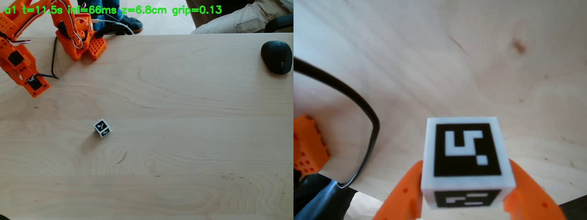

# Two cubes with markers: a real SO-101 arm that calibrates itself, records its own dataset, and learns to pick with NVIDIA Isaac GR00T

[](docs/contest/two-cubes-reel.mp4)

*One-minute video: [`docs/contest/two-cubes-reel.mp4`](docs/contest/two-cubes-reel.mp4). Long read: [`docs/article/linkedin-two-cubes-en.md`](docs/article/linkedin-two-cubes-en.md).*

Two 3D-printed 28 mm cubes with ArUco markers on all six faces are both the object the robot learns to grasp
and the measuring instrument it calibrates itself with. Everything runs on a desk with a
SO-101 arm (LeRobot), two webcams and one RTX 4090. No teleoperation, no motion capture.

| Step | What happens | Result | Code |
|---|---|---|---|
| 1. Cubes | white body + black "key" inlays, unique pocket per marker ID, no rotational symmetry; box with a marker in its floor | print-ready 3MF | `real/cubes/`, `real/box/` |
| 2. Self-calibration | cubes lie on the table, the arm tours 48 poses; one bundle adjustment over marker corners from both cameras solves top-camera pose, wrist-camera pose, per-joint corrections and cube positions | residual 1.6 px, **2.9 mm** on 12 held-out poses; joint scale off by up to 14 % | `real/arm/autocalib_real.py` |
| 3. First grasp | find with the top camera → approach → wrist-camera refinement → grasp → lift → verify → put back | 1 cycle, no intervention | `real/arm/autocalib_real.py grasp` |
| 4. Autonomous dataset | find → grasp → lift → confirm with wrist camera → carry to a random point → release; cubes alternate, every drop reshuffles the scene | **200+ episodes** in two evenings, 30 Hz, both cameras | `real/arm/collect_pilot.py` |
| 5. Recolouring | markers are for algorithms, the policy needs colours: faces projected from the known cube pose, black cells replaced, target colour × per-pixel brightness; gripper fingers preserved | one recording → any cube colours | `mlsim/recolor.py`, `real/arm/recolor_pilot.py` |
| 6. GR00T fine-tuning | NVIDIA Isaac GR00T N1.7 (3B, Cosmos-Reason2 backbone) on one 24 GB RTX 4090, 86 min per model; task split: the policy lifts, an algorithm carries to the box | sim **88/100 lift**, **86/100 in box** (policy + algorithm); first real cube lifted by the fine-tuned model | `ml/gr00t/`, `mlsim/carry.py`, `real/arm/run_policy.py` |
| 7. Keeping the rig honest | calibration watchdog (checks from frames during operation that cameras, robot and box are still in place), self-collision guard on the MuJoCo model, brightness check | 0 false trips on 3744 recorded poses | `real/watch/`, `real/arm/selfcol.py` |

## NVIDIA technology used

- **Isaac GR00T N1.7** (open VLA model) fine-tuned from the public checkpoint; the 24 GB recipe, patches and install script are in the companion repo
  [gr00t-on-4090](https://github.com/VShirokun/gr00t-on-4090) together with three CC-BY datasets on Hugging Face and 1800 evaluated attempts as JSON.
- Training and inference on a single **RTX 4090** (peak 21.7 GB); inference 66 ms per 16-step action chunk on the real arm.
- Evaluation in **MuJoCo** with the official SO-101 model (mujoco_menagerie) and a physics-judged success criterion; the same criterion is used on the real box.

## Honest numbers

- Real policy, lift task, 5-attempt runs today: 1–3 of 5 lifts by video, 1 of 5 by the strict wrist-marker criterion; the typical miss is the fingers closing 2–3 cm beside the cube.
- Hybrid "policy approaches, algorithm centres with the wrist camera and grasps": 2 of 5 on the first run.
- Every miss is recorded (`docs/visual-evidence.md`); the evaluation protocol requires 1200 attempts over two seed sets before claiming an improvement (`ml/gr00t/README.md`).
- Known limitation: recolouring still leaves artefacts near cube edges and around the wrist-camera housing.

## Reproduce

```bash
# rig: SO-101 + C920 above the table + wrist camera; python env with mujoco, opencv (aruco), scipy, pyserial
real/cam/cam_server_linux.py                  # cameras -> /tmp/roboom_cam/latest.jpg, /tmp/roboom_wrist/latest.jpg
real/arm/autocalib_real.py tour|solve|hover   # self-calibration from the two cubes
real/arm/collect_pilot.py --episodes 100      # autonomous dataset
real/arm/recolor_pilot.py --colors green,gray # recolouring
real/arm/pilot_to_lift_v21.py --drop-idle     # LeRobot v2.1 dataset for GR00T
ml/gr00t/train_lift.sh                        # fine-tune (see gr00t-on-4090 for the environment)
real/arm/run_policy.py --policy <ckpt> --servo-grasp   # run on the arm
```

Details, decisions and every deviation from the plan: `docs/real-rig-handoff.md`, `ml/gr00t/DEVIATIONS.md`, `docs/visual-evidence.md`.

## License

MIT. The SO-101 MuJoCo model in `mlsim/models/so101` comes from mujoco_menagerie (see its LICENSE there). Printed parts: CC BY 4.0.
