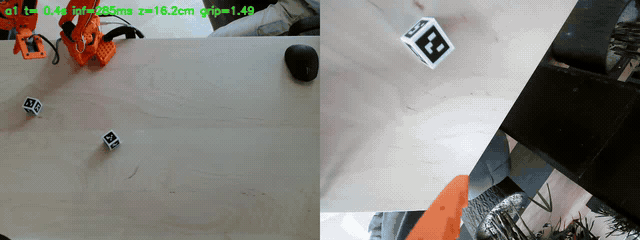
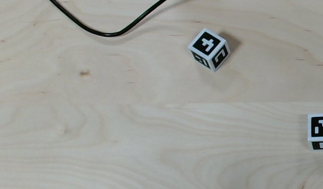
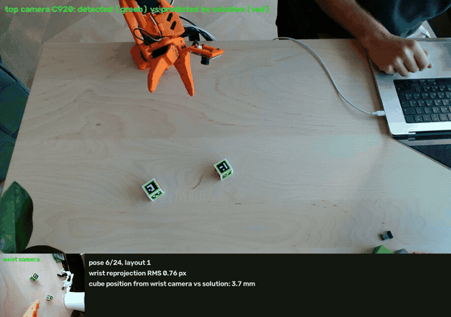
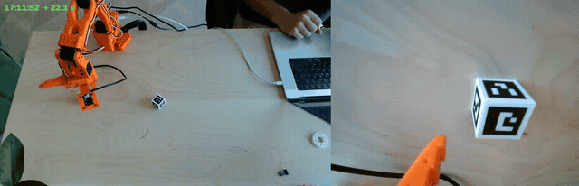
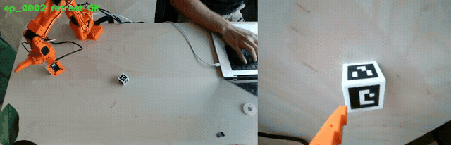
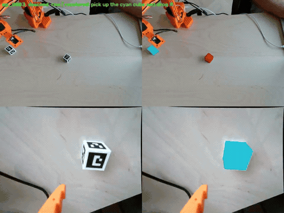
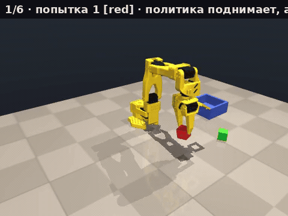
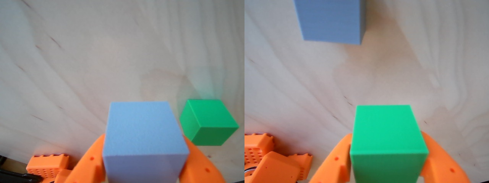
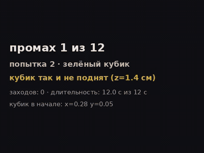
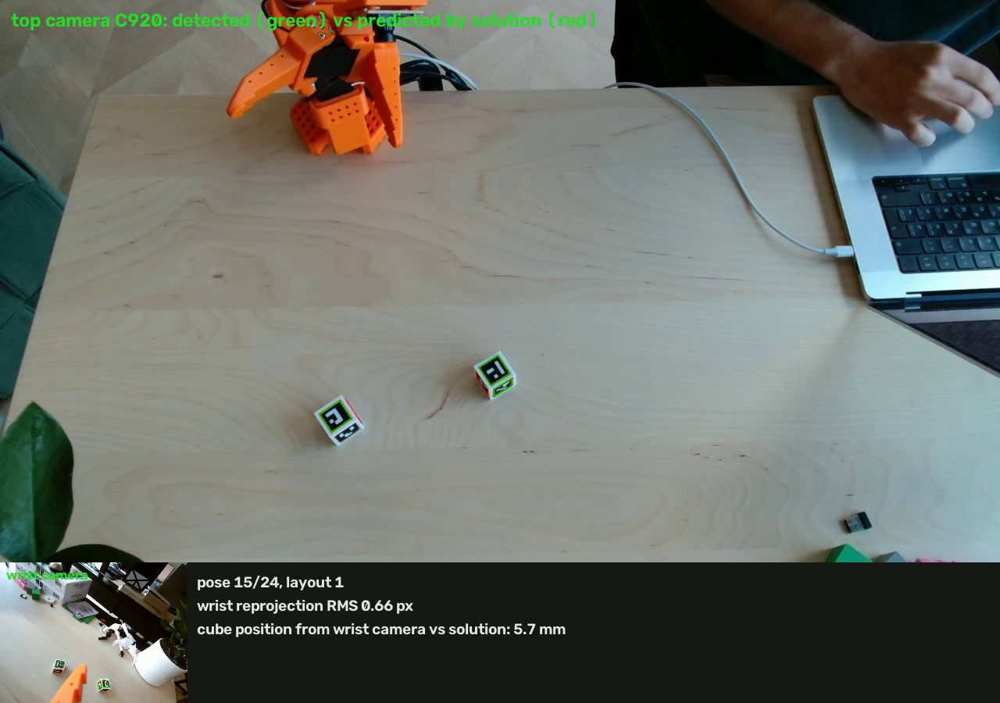

# Two cubes with markers

**A real SO-101 arm that calibrates itself, records its own dataset, recolours it, and learns to pick with NVIDIA Isaac GR00T N1.7 — on one RTX 4090, no teleoperation.**

<p align="center">
  <br>
  <sub>First real cube lifted by the fine-tuned GR00T N1.7 policy. Left: top camera. Right: wrist camera. Caption shows grasp-point height and gripper opening.</sub>
</p>

Two 3D-printed 28 mm cubes with ArUco markers on all six faces are both the object the robot learns to grasp and the measuring instrument it calibrates itself with. Everything runs on a desk: SO-101 arm (LeRobot), two webcams, one 24 GB GPU.

▶ One-minute video: [`docs/contest/two-cubes-reel.mp4`](docs/contest/two-cubes-reel.mp4) · Long read: [`docs/article/linkedin-two-cubes-en.md`](docs/article/linkedin-two-cubes-en.md) · GR00T on one 24 GB GPU: [gr00t-on-4090](https://github.com/VShirokun/gr00t-on-4090)

## The pipeline, step by step

<table>
<tr>
<td width="50%" valign="top">
<br>
<b>1. Cubes you cannot assemble wrong.</b> White body with shaped pockets, six black "key" inlays; each pocket is unique to its marker ID and has no rotational symmetry. Markers on all six faces keep the cube readable lying, held, or in front of the wrist camera. The receiving box has a marker in its floor. Print files: <code>real/cubes/out</code>, <code>real/box/out</code>.
</td>
<td width="50%" valign="top">
<br>
<b>2. Self-calibration from two cubes lying on the table.</b> The arm tours 48 poses aiming the wrist camera at the cubes while the top camera watches them too. One bundle adjustment over marker corners solves top-camera pose, wrist-camera pose, per-joint corrections and cube positions: residual 1.6 px, <b>2.9 mm</b> on 12 held-out poses. Real servos were off by up to 14 % in scale. <code>real/arm/autocalib_real.py</code>
</td>
</tr>
<tr>
<td valign="top">
<br>
<b>3. First grasp with no human in the loop (2.5×).</b> Find with the top camera → approach → refine with the wrist camera → grasp across the faces → lift → verify from above → put back 17 mm from where it was. <code>real/arm/autocalib_real.py grasp</code>
</td>
<td valign="top">
<br>
<b>4. The robot records its own dataset (4×).</b> Grasp → lift → confirm with the wrist camera → carry to a random point → release. Cubes alternate and every drop reshuffles the scene, so no human is needed. <b>200+ episodes</b> in two evenings, both cameras at 30 Hz. <code>real/arm/collect_pilot.py</code>
</td>
</tr>
<tr>
<td valign="top">
<br>
<b>5. Recolouring: one recording, any cube colours.</b> Faces are projected from the known cube pose, black cells replaced by the face's white, target colour × per-pixel brightness; gripper fingers and shadows preserved. Used to train for real green and grey cubes without markers. <code>mlsim/recolor.py</code>, <code>real/arm/recolor_pilot.py</code>
</td>
<td valign="top">
<br>
<b>6. GR00T N1.7 fine-tuned on one RTX 4090.</b> Task split: the policy finds and lifts, a plain algorithm carries to the box. Simulation: policy lifts <b>88/100</b>, policy + algorithm <b>86/100 in the box</b>, wrong cube 0. 86 minutes per model, peak 21.7 GB. <code>ml/gr00t/train_lift.sh</code>, <code>mlsim/carry.py</code>
</td>
</tr>
<tr>
<td valign="top">
<br>
<b>7. On the real arm.</b> First model (raw episodes) froze at hover height and closed beside the cube: the demonstrations contained 4 s of the arm settling motionless and the clone learned to "stand still". Idle frames cut, steps doubled → the policy lifted a real cube. A hybrid "policy approaches, algorithm centres with the wrist camera and grasps" lifts more reliably. <code>real/arm/run_policy.py</code>
</td>
<td valign="top">
<br>
<b>8. Real green and grey cubes, no markers.</b> Wrist-camera colour servo: colour blob → contour rays onto the cube-centre plane → footprint → centre and yaw. Top and wrist cameras agree within 8–9 mm; both cubes grasped and lifted. A GR00T model trained on recoloured data is the next test. <code>real/arm/cube_color.py</code>
</td>
</tr>
</table>


## Teleoperation from a phone (new)

<table><tr>
<td width="50%" valign="top"><b>Web joystick, AR and tilt modes.</b> <code>real/teleop/web_teleop.py</code> serves a phone page with both cameras (WebRTC, MJPEG fallback), two joysticks (motion in the wrist-camera frame; gripper yaw and approach pitch), a gripper slider and a directional boundary glow that reddens the edge you can no longer move towards. <code>/xr</code> uses WebXR on Android: the phone pose drives the gripper 1:1 (position, yaw, pitch); <code>/tilt</code> is the iPhone fallback on device orientation; <code>real/teleop/ios/GripperAR</code> is a native ARKit app speaking the same WebSocket protocol.</td>
<td width="50%" valign="top"><b>Safety and data.</b> Every command goes through the same IK, floor guard, reach limits, self-collision check and 0.5 s deadman as the autonomous collector. One operator at a time (others watch, takeover by button, release after 30 s of silence, safe disconnect). A record button writes the session as collector-format episodes, ready for <code>pilot_to_lift_v21.py</code>. No public IP needed: a supervised Cloudflare quick tunnel publishes its current address.</td>
</tr></table>

## Keeping a wobbly rig honest

<table>
<tr>
<td width="50%" valign="top">
<br>
<b>Every miss is recorded.</b> After each evaluation the tool writes a reel of <i>all</i> failures with a diagnosis card (where the cube went, how many tries, how long). Failure analysis by eye is a project rule; the numbers alone hid the real causes twice. <code>ml/gr00t/eval_groot_lift.py --fail-reel</code>
</td>
<td width="50%" valign="top">
<br>
<b>Watchdog and guards.</b> A calibration watchdog reads only camera frames and telemetry during operation and reports <i>what</i> moved (camera, robot, box) from phase correlation of the table, marker anchors and arm silhouette. A self-collision guard on the MuJoCo model checks every commanded pose (0 false trips on 3744 recorded poses). A brightness check refuses to run in the dark. <code>real/watch/calib_watch.py</code>, <code>real/arm/selfcol.py</code>
</td>
</tr>
</table>

## NVIDIA technology used

- **Isaac GR00T N1.7** (open 3B VLA, Cosmos-Reason2 backbone) fine-tuned from the public checkpoint. The 24 GB recipe, patches, install script, three CC-BY datasets on Hugging Face and 1800 evaluated attempts as JSON live in [gr00t-on-4090](https://github.com/VShirokun/gr00t-on-4090).
- Training and inference on a single **RTX 4090**; 66 ms per 16-step action chunk on the real arm.
- **MuJoCo** with the official SO-101 model (mujoco_menagerie) for the calibration solver, self-collision guard, expert data and physics-judged evaluation.

## Honest numbers

- Real policy, lift task, 5-attempt runs: 1–3 of 5 lifts by video, 1 of 5 by the strict wrist-marker criterion. Typical miss: fingers close 2–3 cm beside the cube.
- Hybrid (policy approaches, algorithm grasps): 2 of 5 on the first run.
- Evaluation noise is ±2.3 pp per 100 attempts; an improvement is claimed only on 1200 attempts over two seed sets (`ml/gr00t/README.md`).
- Recolouring v5 removed the dark marker remnants on the held cube (dark fraction inside the cube 0.041 → 0.001); a side face seen at a grazing angle in the top camera can still be partly unpainted.
- Every decision and deviation: `ml/gr00t/DEVIATIONS.md`, `docs/visual-evidence.md`, `docs/real-rig-handoff.md`.

## Reproduce

```bash
# rig: SO-101 + C920 above the table + wrist camera; python env with mujoco, opencv (aruco), scipy, pyserial
real/cam/cam_server_linux.py                  # cameras -> /tmp/roboom_cam/latest.jpg, /tmp/roboom_wrist/latest.jpg
real/arm/autocalib_real.py tour|solve|hover   # self-calibration from the two cubes
real/arm/collect_pilot.py --episodes 100      # autonomous dataset
real/arm/recolor_pilot.py --colors green,gray # recolouring
real/arm/pilot_to_lift_v21.py --drop-idle     # LeRobot v2.1 dataset for GR00T
ml/gr00t/train_lift.sh                        # fine-tune (environment: see gr00t-on-4090)
real/arm/run_policy.py --policy <ckpt> --servo-grasp   # run on the arm
```

Paths in the scripts point at our machine (`/srv/data/...`); adjust to yours.

## License

MIT. The SO-101 MuJoCo model in `mlsim/models/so101` comes from mujoco_menagerie (see its LICENSE there). Printed parts: CC BY 4.0.
